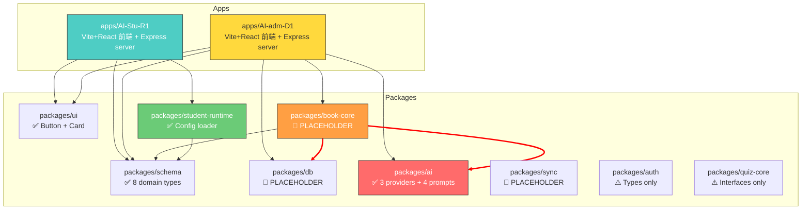
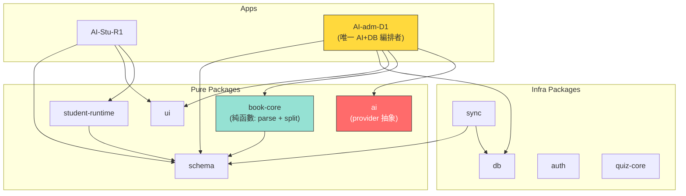

# OPUS Architecture Review — Phase 0.5

> **Reviewer**: Opus 4 (Architecture Auditor)
> **Date**: 2026-06-11
> **Scope**: Read-only full-project audit — AI-SmartBook-R1 monorepo
> **Mode**: Zero-modification review. Every source file inspected.

---

## Table of Contents

1. [Architecture Scorecard](#1-architecture-scorecard)
2. [Monorepo 架構合理性](#2-monorepo-架構合理性)
3. [AI-Stu-R1：1GB 小電腦部署適性](#3-ai-stu-r11gb-小電腦部署適性)
4. [AI-adm-D1：簡易智能書本後台適性](#4-ai-adm-d1簡易智能書本後台適性)
5. [packages/* 模組分工分析](#5-packages-模組分工分析)
6. [deploy/systemd & deploy/nginx 輕量部署審查](#6-deploysystemd--deploynginx-輕量部署審查)
7. [legacy/old-frontend-ux-reference 隔離性](#7-legacyold-frontend-ux-reference-隔離性)
8. [API Key 安全邊界](#8-api-key-安全邊界)
9. [Scope 失控風險分析](#9-scope-失控風險分析)
10. [模組邊界建議](#10-模組邊界建議)
11. [風險清單](#11-風險清單)
12. [Codex 實作前必須注意事項](#12-codex-實作前必須注意事項)
13. [Phase 0.5 進入建議](#13-phase-05-進入建議)

---

## 1. Architecture Scorecard

| 審查項目 | 評分 | 說明 |
|---------|:----:|------|
| Monorepo 結構合理性 | ⭐⭐⭐⭐☆ **4/5** | pnpm workspace 正確，apps/packages 分層清晰。但兩個 app 均缺 `vite.config.ts` 和 `tsconfig.json` |
| 1GB 部署適性 (AI-Stu-R1) | ⭐⭐⭐⭐⭐ **5/5** | 記憶體預算合理，systemd MemoryMax=256M，`--max-old-space-size=128` 已設限 |
| 後台適性 (AI-adm-D1) | ⭐⭐⭐⭐☆ **4/5** | Express + Vite 雙模架構適合快速開發，AI provider 完整，但 admin 路由僅有 2 個 endpoint stub |
| 模組分工清晰度 | ⭐⭐⭐☆☆ **3/5** | `schema` 和 `ai` 設計優良，但 **`book-core → ai` 耦合違反邊界原則**，`db` 為空殼 |
| 輕量部署完備度 | ⭐⭐⭐⭐⭐ **5/5** | systemd + nginx + 部署腳本 + healthcheck + rsync 齊全 |
| Legacy 隔離性 | ⭐⭐⭐⭐☆ **4/5** | 無 package.json、有 README 警告，但含 57 元件 + 116 頁面的龐大前端參考 |
| API Key 安全性 | ⭐⭐⭐⭐⭐ **5/5** | 零硬編碼金鑰、student 端架構隔離、SMOKE_TEST 有自動化 grep 檢查 |
| Scope 控制 | ⭐⭐⭐⭐☆ **4/5** | Phase 0.5 文件控制良好，但 placeholder 多、大型 legacy 參考易誘發 scope creep |
| **總評** | **⭐⭐⭐⭐☆ 4.3/5** | **架構設計良好，修復 book-core 耦合和補齊缺失配置後可進入 Phase 0.5** |

---

## 2. Monorepo 架構合理性

### ✅ 優點

- **pnpm workspace** 正確配置 (`apps/*` + `packages/*`)，monorepo 管理清晰
- **Root package.json** 腳本齊全：`dev` 平行啟動、`build` 遞迴、`db:migrate/seed`、`student:build` / `admin:build`
- **tsconfig.base.json** 統一 ES2022 + Bundler 模組解析 + React JSX + strict mode
- **packageManager** 鎖定 `pnpm@9.15.0`，可重現性好
- **9 個 packages** 分工明確：schema / db / ui / book-core / student-runtime / ai / sync / auth / quiz-core

### ⚠️ 問題

| 問題 | 嚴重度 | 說明 |
|------|:------:|------|
| 兩個 app 缺少 `vite.config.ts` | 🟡 中 | 依賴 Vite 預設值。無法設定 proxy、自訂 build、路徑別名等 |
| 兩個 app 缺少 `tsconfig.json` | 🟡 中 | `pnpm typecheck` 會因為找不到 tsconfig 而失敗或使用意外配置 |
| 大量空目錄 | 🟢 低 | AI-Stu-R1 有 6 個空目錄、AI-adm-D1 有 5 個空目錄，不影響功能但顯示結構超前實作 |
| `tools/`、`data/`、`exports/`、`uploads/` 全為空 | 🟢 低 | 正確不在 workspace 內，佔位用 |

### 實際依賴關係圖

> [!IMPORTANT]
> 以下依賴圖基於各 `package.json` 的 `dependencies` 欄位實際驗證，非推測。



> [!CAUTION]
> **紅線警告**：`packages/book-core` 同時依賴 `packages/ai` 和 `packages/db`。
> 這意味著 book-core 不是一個純粹的「PDF 解析 + 內容處理」模組，而是一個同時觸及 AI 呼叫和資料庫寫入的混合模組。
> 這違反了 `MODULE_DESIGN.md` 中「單一職責」的原則，且讓 book-core 無法被 student 端安全引用。

---

## 3. AI-Stu-R1：1GB 小電腦部署適性

### 評定：✅ 非常適合

| 資源 | 預估用量 | 配置依據 |
|------|---------|---------|
| OS (Linux) | ~200 MB | 精簡 Linux 發行版 |
| Node.js student API | 100–150 MB | `NODE_OPTIONS=--max-old-space-size=128`（deploy/systemd/student.env.example） |
| systemd MemoryMax | 256 MB 硬限 | `MemoryHigh=200M, MemoryMax=256M`（ai-stu-r1.service） |
| Nginx | ~20 MB | 靜態檔 + 反向代理 |
| SQLite | 10–50 MB | 檔案型 DB，無常駐服務 |
| **合計** | **~380–420 MB** | **1GB 內安全裕度 ≥ 500 MB** ✅ |

### 架構正確性

- **前端**：Vite + React 19 + react-router-dom 7，建構後為純靜態 SPA，由 Nginx 直接服務
- **後端**：`server/stu-api.ts` 為獨立 Express 伺服器，4 個 endpoint：
  - `GET /api/student/books` — 書本列表
  - `GET /api/student/books/:bookId` — 書本詳情
  - `GET /api/student/books/:bookId/contents` — 書本內容
  - `POST /api/student/books/:bookId/chat` — keyword chat（非 AI）
- **Runtime 依賴**：僅 `@ai-smartbook/schema`、`@ai-smartbook/ui`、`@ai-smartbook/student-runtime` — **無 AI 依賴** ✅
- **Student-runtime** 是純配置載入器（`loadStudentRuntimeConfig()`），不含 Express 或 DB 邏輯

### ⚠️ 需注意

| 項目 | 說明 |
|------|------|
| 缺少 `vite.config.ts` | 無法設定 dev proxy（前端 dev 模式下 `/api/student/` 無法代理到 stu-api） |
| 缺少 `tsconfig.json` | `pnpm typecheck` 可能失敗 |
| `stu-api.ts` 直接內建路由 | 未使用 `server/routes/` 和 `server/services/` 空目錄，代碼可維護性待觀察 |
| `student-runtime` 與 `stu-api.ts` 的關係 | student-runtime 只提供 config，stu-api.ts 包含實際 Express 邏輯。兩者職責清楚但命名可能令人困惑 |

---

## 4. AI-adm-D1：簡易智能書本後台適性

### 評定：✅ 適合，但大量 TODO

### 雙模架構

AI-adm-D1 是一個 **前後端混合 app**：
- **前端**：Vite + React 19，port 5174，`src/main.tsx` 渲染 admin shell UI
- **後端**：Express，port 4300，`src/server/index.ts` 提供 admin API

| 已具備 | 待實作 |
|--------|--------|
| Express 伺服器 + 2 個 endpoint | 路由全部為 stub |
| `POST /api/admin/books/:bookId/qa` 接 AI provider | CRUD 路由 |
| Vite 前端 shell（列出 Phase 0.5 admin 頁面路徑） | 實際 admin UI 頁面 |
| AI provider 工廠 `createAiProvider()` 已接入 | PDF 上傳 + 解析流程 |
| 空目錄預留結構（api/components/pages/routes/styles） | 填充這些目錄 |

### 依賴分析

```json
"dependencies": {
  "@ai-smartbook/schema": "workspace:*",    // ✅ 共享型別
  "@ai-smartbook/db": "workspace:*",        // ⚠️ db 目前是空殼
  "@ai-smartbook/ui": "workspace:*",        // ✅ 共用元件
  "@ai-smartbook/book-core": "workspace:*", // ⚠️ book-core 目前是空殼
  "@ai-smartbook/ai": "workspace:*",        // ✅ AI provider（正確的唯一消費者）
  "express": "^4.19.2",                     // ✅
  "multer": "^1.4.5-lts.1"                  // ✅ PDF 上傳用
}
```

> [!NOTE]
> AI-adm-D1 是 `packages/ai` 的 **唯一正當消費者**。這是正確的設計。
> 但 `packages/book-core` 也依賴 `packages/ai`，這讓 AI 的使用範圍超出了 admin app 直接控制。

---

## 5. packages/* 模組分工分析

### 模組狀態總覽

| Package | 檔案數 | 實作狀態 | 消費者 | 分工清晰度 |
|---------|:------:|---------|--------|-----------|
| **schema** | 9 files | ✅ **完整** — 8 domain entities, Zod schemas, Input/Update types | 全部模組 | ⭐⭐⭐⭐⭐ |
| **ai** | 10 files | ✅ **完整** — 3 providers (Mock/Gemini/OpenAI), 4 prompt templates, factory | AI-adm-D1, book-core | ⭐⭐⭐⭐⭐ |
| **student-runtime** | 2 files | ✅ **完整** — Config types + loader | AI-Stu-R1 | ⭐⭐⭐⭐⭐ |
| **ui** | 4 files | ✅ **極簡** — Button, Card | AI-Stu-R1, AI-adm-D1 | ⭐⭐⭐☆☆ |
| **auth** | 2 files | ⚠️ **Types only** — Role, AuthUser, GoogleOAuthAdapter types | 無消費者 | ⭐⭐⭐☆☆ |
| **quiz-core** | 2 files | ⚠️ **Interfaces only** — QuizQuestion, QuizGenerator, QuizGrader | 無消費者 | ⭐⭐⭐☆☆ |
| **db** | 2 files | 🔴 **空殼** — `export const dbPackageReady = true` + TODO | AI-adm-D1, book-core | ⭐⭐☆☆☆ |
| **book-core** | 2 files | 🔴 **空殼** — `export const bookCoreReady = true` + TODO | AI-adm-D1 | ⭐⭐☆☆☆ |
| **sync** | 2 files | 🔴 **空殼** — Stub functions that throw errors | 無消費者 | ⭐⭐☆☆☆ |

### Schema 詳細分析（亮點）

`packages/schema` 是目前最完整的模組，定義了 8 個 domain entity：

| Schema | 用途 | 完整度 |
|--------|------|--------|
| `book.schema` | 書本 CRUD，含 status (draft/published/archived) | ✅ CRUD types |
| `bookFile.schema` | 上傳檔案管理，含 parseStatus (pending/parsed/failed) | ✅ |
| `bookContent.schema` | 書本內容段落，含 pageNumber + orderIndex | ✅ |
| `chapter.schema` | 章節管理，含 pageStart/pageEnd | ✅ CRUD types |
| `chat.schema` | 聊天對話，含 session + message + role | ✅ |
| `aiJob.schema` | AI 任務追蹤，含 4 種 jobType + 4 種 status | ✅ |
| `qaLog.schema` | QA 記錄，含 provider + model 欄位 | ✅ |
| `sync.schema` | 同步匯出封包，含 schemaVersion | ✅ |

> [!TIP]
> Schema 設計成熟度遠超其他模組。建議以 schema 為根基，Phase 0.5 第一步是讓 `packages/db` 的 Drizzle schema 完全對齊這些 Zod types。

### AI Package 詳細分析（亮點）

`packages/ai` 是第二完整的模組，生產級設計：

- **3 providers**：`MockAiProvider`（含智慧 mock 回應）、`GeminiAiProvider`（真實 API 呼叫）、`OpenAiCompatibleProvider`
- **4 prompt templates**：`split-book`、`build-chapters`、`summarize-chapter`、`book-qa` — 使用 task tag 模式 (`[[task:xxx]]`)
- **Factory pattern**：`createAiProvider()` 根據 env 自動選擇 provider，API key 缺失時自動降級為 mock
- **Zero hardcoded keys**：全部從 `process.env` 讀取

### 🔴 關鍵問題：book-core 依賴 ai + db

```json
// packages/book-core/package.json dependencies:
{
  "@ai-smartbook/ai": "workspace:*",     // ⚠️ 不應直接依賴 AI
  "@ai-smartbook/db": "workspace:*",     // ⚠️ 不應直接依賴 DB
  "@ai-smartbook/schema": "workspace:*", // ✅ 正確
  "pdf-parse": "latest"                  // ✅ 正確
}
```

**問題**：
1. `book-core` 的職責應該是「PDF 解析 + 內容切割 + 章節建構」— 純粹的內容處理
2. 讓它直接依賴 `ai` 意味著它會自己呼叫 AI provider，而不是由 admin app 編排
3. 讓它直接依賴 `db` 意味著它會自己寫入資料庫，違反「apps 負責 orchestration」的原則
4. 這使得 book-core **無法被 student 端安全引用**（雖然目前 student 不引用它）

**建議**：將 `book-core` 改為純函數模組，接受輸入、回傳結果，不自己呼叫 AI 或寫 DB。AI 呼叫和 DB 寫入由 `AI-adm-D1` 的路由層負責編排。

---

## 6. deploy/systemd & deploy/nginx 輕量部署審查

### 評定：✅ 優秀，符合 1GB 輕量部署

**systemd 配置** (`deploy/systemd/`)：

| 檔案 | 內容 | 評估 |
|------|------|------|
| `ai-stu-r1.service` | Node.js 服務，MemoryHigh=200M / MemoryMax=256M，Restart=always/3s | ✅ 優秀 |
| `student.env.example` | `NODE_OPTIONS=--max-old-space-size=128`，keyword chat，readonly mode | ✅ 安全 |

**nginx 配置** (`deploy/nginx/ai-stu-r1.conf`)：
- ✅ 靜態檔 root `/opt/AI-Stu-R1/dist` + SPA fallback
- ✅ 反向代理 `/api/student/` → `127.0.0.1:4310`
- ✅ 極簡配置，無多餘模組

**部署腳本** (`deploy/scripts/`)：

| 腳本 | 用途 | 評估 |
|------|------|------|
| `install-student-systemd.sh` | 一鍵安裝 systemd service + env file | ✅ |
| `healthcheck-student.sh` | curl `/api/student/books` | ✅ |
| `sync-student-db.sh` | rsync dist + student.db 到目標機 | ✅ |

**deploy/README.md** 明確排除：PM2、Docker、MySQL、Redis、Qdrant、Ollama、pnpm dev、PDF parse、full RAG。

### ⚠️ 改進建議

| 項目 | 現況 | 建議 |
|------|------|------|
| HTTPS | 未配置 | 若有公網暴露需求，加入 Certbot |
| Nginx gzip | 未配置 | 加入 `gzip on; gzip_types text/html application/json application/javascript text/css;` |
| 日誌輪替 | 未配置 | systemd journal 預設會輪替，但建議加 `MaxFileSec=1day` 或 `SystemMaxUse=50M` |
| 回滾機制 | 無 | `sync-student-db.sh` 無回滾，建議 rsync 前備份 |
| admin 部署 | 無 | 只有 student 的部署配置，admin 部署尚未規劃（合理，admin 不在 1GB 機器） |

---

## 7. legacy/old-frontend-ux-reference 隔離性

### 評定：✅ 已隔離，但體積龐大需注意

**隔離措施：**
- ✅ 不在 `pnpm-workspace.yaml` 範圍內
- ✅ 無 `package.json` — 無法被 `pnpm install` 掃到
- ✅ 有 `README.md` 明確警告：「reference only — 不要複製 backend、routers、MySQL、credits、admin」
- ✅ `docs/OLD_FRONTEND_UX_IMPORT.md` 有完整使用規範
- ✅ 放在 `legacy/` 而非 `packages/` 或 `apps/` — 心理隔離明確

**體積與範圍：**

| 項目 | 數量 |
|------|------|
| components/ | **57 個元件**（AIChatBox, PdfViewer, QuestionPanel, RichTextEditor...） |
| pages/ | **116+ 個頁面**（AdminSmartBooks 194KB, Chat 165KB, AiQuestionPractice 151KB...） |
| hooks/ | 4 個 |
| lib/ | 6 個工具檔 |
| features/ | smartbook/, tutor-chat/ |
| App.tsx | 26KB, 414 lines, **130+ lazy-loaded pages** |

**技術棧差異（天然隔離屏障）：**

| 舊前端 (legacy) | 新前端 (AI-Stu-R1) |
|----------------|-------------------|
| Tailwind v4 | 純 CSS（inline styles） |
| tRPC + React Query | REST fetch |
| Wouter routing | react-router-dom 7 |
| `@shared/const` 內部包 | `@ai-smartbook/schema` |
| OAuth + 多角色 | 無 auth（Phase 0.5） |

**污染風險點：**
- ⚠️ `components/Map.tsx` 中有 `import.meta.env.VITE_FRONTEND_FORGE_API_KEY`（無硬編碼值，但 copy-paste 可能引入依賴）
- ⚠️ Legacy 中有 `import("../../../server/routers")` 相對引用（指向不存在的舊後端），確認為 reference-only

> [!NOTE]
> 技術棧差異極大，直接 copy-paste 幾乎必定無法編譯。這反而是最強的天然隔離。但 **UX 設計模式**（佈局、交互流程、元件概念）仍然是有價值的參考。

---

## 8. API Key 安全邊界

### 評定：✅ 優秀 — 零洩漏風險

**全專案掃描結果：**

| 搜尋目標 | 命中 | 位置 | 風險 |
|---------|:----:|------|:----:|
| `GEMINI_API_KEY` | 3 | `.env.example`（空值）、`packages/ai/src/provider.ts`（process.env）、`SMOKE_TEST.md`（grep 規則） | ✅ 零 |
| `OPENAI_API_KEY` | 3 | 同上 | ✅ 零 |
| `VITE_FRONTEND_FORGE_API_KEY` | 1 | `legacy/.../Map.tsx`（import.meta.env） | ⚠️ 低 |
| 硬編碼金鑰 (AIza*, sk-*, ghp_*) | 0 | — | ✅ 零 |
| 已提交 .env 檔案 | 0 | — | ✅ 零 |

**架構級安全隔離：**

```
┌─────────────────────────────────────────────────┐
│  1GB Student Machine                            │
│                                                 │
│  ┌─────────────────────────────────────────┐    │
│  │  Nginx (port 80)                        │    │
│  │  → 靜態檔: /opt/AI-Stu-R1/dist         │    │
│  │  → 反向代理: /api/student/ → :4310     │    │
│  └─────────────────────────────────────────┘    │
│                                                 │
│  ┌─────────────────────────────────────────┐    │
│  │  Node.js stu-api (port 4310)            │    │
│  │  ❌ 無 packages/ai 依賴                  │    │
│  │  ❌ 無 API Key 環境變數                   │    │
│  │  ✅ keyword chat only                    │    │
│  │  ✅ readonly SQLite                      │    │
│  └─────────────────────────────────────────┘    │
│                                                 │
│  student.env: NO API KEYS ✅                    │
└─────────────────────────────────────────────────┘

┌─────────────────────────────────────────────────┐
│  Admin Machine (開發者/管理者電腦)                │
│                                                 │
│  ┌─────────────────────────────────────────┐    │
│  │  AI-adm-D1 (port 4300)                  │    │
│  │  ✅ packages/ai 依賴                     │    │
│  │  ✅ GEMINI_API_KEY from process.env      │    │
│  │  ✅ OPENAI_API_KEY from process.env      │    │
│  │  ✅ API key 缺失時自動降級為 mock         │    │
│  └─────────────────────────────────────────┘    │
└─────────────────────────────────────────────────┘
```

**自動化安全檢查（已存在於 SMOKE_TEST.md）：**
- grep 確認 AI-Stu-R1 不包含 `API_KEY` 字串
- grep 確認無 mysql、Docker、PM2 引用

> [!IMPORTANT]
> 建議將 `SMOKE_TEST.md` 的 grep 檢查轉為可執行腳本（如 `scripts/boundary-check.sh`），納入 CI pipeline。

---

## 9. Scope 失控風險分析

### 風險矩陣

| 風險 | 可能性 | 影響 | 觸發條件 |
|------|:------:|:----:|---------|
| **book-core 變成 God module** | 🔴 高 | 🔴 高 | 它已依賴 ai + db + schema + pdf-parse，Phase 0.5 填充後可能變成「什麼都做」 |
| Legacy UX 過度參考 | 🟡 中 | 🔴 高 | 開發者看到 116 頁面的 legacy，試圖實作超出 Phase 0.5 scope 的功能 |
| AI 功能 scope creep | 🟡 中 | 🔴 高 | 4 個 prompt template 已就緒，容易誘發「都做好了不如也實作 RAG」 |
| DB schema 與 Schema types 不一致 | 🟡 中 | 🟡 中 | `packages/db` 為空殼，填充時可能偏離 `packages/schema` 的 Zod 定義 |
| auth/quiz-core 提前填充 | 🟡 中 | 🟡 中 | placeholder 存在就容易手癢去實作 |
| PDF 解析邊界情況爆炸 | 🟡 中 | 🟡 中 | 各種 PDF 格式差異大，容易陷入「再支援一種格式」的循環 |
| 多書本 UI 提前引入 | 🟢 低 | 🟡 中 | Schema 已支援多書本，但 Phase 0.5 目標是單書本 |

### 已有的 Scope 防護

- ✅ `PHASE_0_5_PLAN.md` 明確列出 scope 和 non-goals（OAuth、full RAG、quiz gen、credits、MySQL、Redis、Docker）
- ✅ `SMOKE_TEST.md` 有 grep 禁止模式
- ✅ `MODULE_DESIGN.md` 有明確規則
- ✅ `ROLE_SPLIT.md` 定義角色分工（ChatGPT=PM, Opus=架構, Codex=實作）
- ✅ `deploy/README.md` 明確排除重量級技術

---

## 10. 模組邊界建議

### 必須維護的紅線（不可違反）

| 邊界 | 理由 | 現況 |
|------|------|------|
| `packages/ai` ──✕──→ `AI-Stu-R1` | Student 不可有 AI 依賴 | ✅ 遵守中 |
| `packages/ai` ──✕──→ `student-runtime` | Student 不可有 AI 依賴 | ✅ 遵守中 |
| API Key env ──✕──→ `student.env` | 學生機器不放 key | ✅ 遵守中 |
| `packages/db` write ──✕──→ student runtime | Student 端只讀 | ⚠️ 需強制 |
| `packages/db` ──✕──→ `AI-Stu-R1` 前端 | 前端不碰 DB | ✅ 遵守中 |

### 建議新增/修改的邊界

| 邊界 | 理由 | 行動 |
|------|------|------|
| `packages/book-core` ──✕──→ `packages/ai` | book-core 應為純內容處理，AI 呼叫由 admin app 編排 | **從 book-core/package.json 移除 @ai-smartbook/ai** |
| `packages/book-core` ──✕──→ `packages/db` | book-core 不應直接寫 DB，由 admin 路由負責 | **從 book-core/package.json 移除 @ai-smartbook/db** |
| `packages/sync` ──✕──→ `student-runtime` | student 端不需要 sync 能力 | ✅ 目前已遵守 |
| `packages/ui` ──✕──→ `packages/db, ai` | UI 為純展示層 | ✅ 目前已遵守 |

### 修正後的理想依賴圖



### 建議的自動化邊界檢查腳本

```bash
#!/usr/bin/env bash
# scripts/boundary-check.sh
set -euo pipefail
FAIL=0

echo "=== Module Boundary Check ==="

# Student app must not import AI or DB
grep -r "@ai-smartbook/ai" apps/AI-Stu-R1/ 2>/dev/null && echo "❌ FAIL: AI-Stu-R1 imports ai" && FAIL=1
grep -r "@ai-smartbook/db" apps/AI-Stu-R1/ 2>/dev/null && echo "❌ FAIL: AI-Stu-R1 imports db" && FAIL=1

# Student runtime must not import AI
grep -r "@ai-smartbook/ai" packages/student-runtime/ 2>/dev/null && echo "❌ FAIL: student-runtime imports ai" && FAIL=1

# book-core should not import AI or DB (after fix)
grep -r "@ai-smartbook/ai" packages/book-core/package.json 2>/dev/null && echo "⚠️  WARN: book-core depends on ai" && FAIL=1
grep -r "@ai-smartbook/db" packages/book-core/package.json 2>/dev/null && echo "⚠️  WARN: book-core depends on db" && FAIL=1

# No API keys in student deployment
grep -rI "API_KEY" deploy/systemd/student.env.example 2>/dev/null && echo "❌ FAIL: student.env has API_KEY" && FAIL=1

# No forbidden tech
grep -rI "mysql\|MySQL\|docker\|Docker\|PM2\|pm2\|redis\|Redis" apps/ packages/ 2>/dev/null && echo "❌ FAIL: forbidden tech reference found" && FAIL=1

[ $FAIL -eq 0 ] && echo "✅ All boundary checks passed" || echo "❌ Boundary violations detected"
exit $FAIL
```

---

## 11. 風險清單

### 🔴 高優先修復（進入 Phase 0.5 前必須處理）

| # | 風險 | 位置 | 建議行動 |
|---|------|------|---------|
| H1 | **book-core 依賴 ai + db** — 違反模組邊界 | [book-core/package.json](file:///home/b827262/project/AI-SmartBook-R1/packages/book-core/package.json) | 移除 `@ai-smartbook/ai` 和 `@ai-smartbook/db` 依賴。book-core 應只做 PDF 解析和內容切割（純函數），AI 呼叫和 DB 寫入由 admin app 路由層編排 |
| H2 | **兩個 app 缺少 vite.config.ts** | [AI-Stu-R1/](file:///home/b827262/project/AI-SmartBook-R1/apps/AI-Stu-R1), [AI-adm-D1/](file:///home/b827262/project/AI-SmartBook-R1/apps/AI-adm-D1) | 加入 vite.config.ts（設定 dev proxy、build output、React plugin） |
| H3 | **兩個 app 缺少 tsconfig.json** | 同上 | 加入 tsconfig.json extends `../../tsconfig.base.json`，讓 `pnpm typecheck` 可運行 |
| H4 | **packages/db 為空殼** — `export const dbPackageReady = true` | [db/src/index.ts](file:///home/b827262/project/AI-SmartBook-R1/packages/db/src/index.ts) | Phase 0.5 第一步：實作 Drizzle schema 對齊 packages/schema 的 8 個 Zod types |

### 🟡 中優先（Phase 0.5 期間處理）

| # | 風險 | 位置 | 建議行動 |
|---|------|------|---------|
| M1 | Admin 後台無認證 | AI-adm-D1 server | 加入基礎 API key 認證中介層（Bearer token 即可） |
| M2 | Admin Express 使用 `express@4.19.2` | AI-adm-D1/package.json | root `.env.example` 標示為 Express 5，但 app 實際用 v4。統一版本 |
| M3 | Student runtime 無 DB readonly 強制 | packages/db | 加入 `PRAGMA query_only = ON` 或 readonly 連線模式 |
| M4 | Nginx 未啟用 gzip | deploy/nginx/ai-stu-r1.conf | 加入 gzip 壓縮 |
| M5 | 無部署回滾機制 | deploy/scripts/ | rsync 前備份 |
| M6 | `devDependencies` 使用 `"latest"` | 多個 package.json | 鎖定具體版本範圍，避免 breaking change |

### 🟢 低優先（Phase 1.0+）

| # | 風險 | 位置 | 建議行動 |
|---|------|------|---------|
| L1 | Legacy 體積龐大（57 元件 + 116 頁面） | legacy/ | 考慮移至獨立 repo 或 submodule |
| L2 | auth / quiz-core 為空殼 | packages/auth, quiz-core | 在 README 標註「Phase 1.0+」 |
| L3 | HTTPS 未配置 | deploy/nginx/ | 公網暴露時加入 Certbot |
| L4 | `packages/db/tsconfig.json` 未 extends base | packages/db/tsconfig.json | 統一使用 `extends: ../../tsconfig.base.json` |

---

## 12. Codex 實作前必須注意事項

> [!CAUTION]
> 以下為 Codex CLI 或任何自動化代碼生成工具進入實作前的 **硬性要求**。

### 12.1 不可觸碰的邊界

1. **❌ 不要讓 AI-Stu-R1 或 student-runtime 引入 `packages/ai`** — 安全模型基石
2. **❌ 不要在 student.env 中加入任何 API Key** — student 機器無 AI 金鑰
3. **❌ 不要引入 MySQL、Redis、Docker、PM2** — 1GB 部署不允許
4. **❌ 不要從 legacy 直接 copy-paste 代碼** — 技術棧完全不同（Tailwind/tRPC/Wouter vs 純 CSS/REST/RRD）
5. **❌ 不要讓 book-core 自行呼叫 AI 或寫入 DB** — 改為純函數模組

### 12.2 實作前必須完成的 Gate 項目

| # | 項目 | 原因 |
|---|------|------|
| G1 | 修正 `book-core/package.json` 移除 ai + db 依賴 | 模組邊界 |
| G2 | 為兩個 app 加入 `vite.config.ts` | dev proxy、build 配置 |
| G3 | 為兩個 app 加入 `tsconfig.json` | typecheck 可運行 |
| G4 | 驗證 `pnpm install` 成功 | workspace 引用正確 |
| G5 | 驗證 `pnpm typecheck` 通過 | 現有代碼無型別錯誤 |
| G6 | 加入 `scripts/boundary-check.sh` 並執行通過 | 自動化邊界防護 |

### 12.3 Phase 0.5 實作優先順序建議

```
Phase 0.5 實作順序（嚴格遵守）：

  ① packages/db
     → Drizzle schema 對齊 packages/schema 的 8 個 types
     → connection.ts（含 readonly 模式）
     → migration 0001_init.sql
     → repositories CRUD
     → seed.ts（demo 書本資料）

  ② packages/book-core
     → parsePdfToContents()（使用 pdf-parse）
     → splitBookIntoChapters()（純函數，回傳結構化資料）
     → 不呼叫 AI，不寫 DB

  ③ apps/AI-adm-D1 server
     → books CRUD 路由
     → chapters CRUD 路由
     → PDF upload → book-core 解析 → db 寫入（admin 路由層編排）
     → AI QA 路由（admin 路由層呼叫 packages/ai）

  ④ apps/AI-adm-D1 frontend
     → 基本 admin UI（書本列表、章節管理、QA 測試面板）

  ⑤ packages/student-runtime + apps/AI-Stu-R1 server
     → stu-api.ts 接 packages/db 讀取真實資料
     → readonly SQLite 連線

  ⑥ apps/AI-Stu-R1 frontend
     → 書本閱讀頁（參考 legacy UX 模式）
     → keyword chat 面板

  ⑦ deploy
     → 部署到 1GB 目標機器驗證
     → healthcheck 通過
```

### 12.4 Phase 0.5 禁止引入的功能

- ❌ OAuth / 完整使用者系統
- ❌ Full RAG（向量搜尋 + embedding）
- ❌ 測驗生成系統 (quiz-core)
- ❌ 學分/積分系統
- ❌ 多書本管理 UI（schema 支援但 UI 只做單書本）
- ❌ 即時通知 / WebSocket
- ❌ TTS（text-to-speech，legacy 有但不搬）
- ❌ Google Maps（legacy 有但不搬）

---

## 13. Phase 0.5 進入建議

### 結論：✅ 建議進入 Phase 0.5 實作

**附帶條件：先完成 6 個 Gate 項目（G1-G6）**

**核心理由：**

1. **架構基礎紮實** — monorepo 結構、模組分層、依賴方向大體正確
2. **Schema 設計成熟** — 8 個 domain entity 的 Zod types 已完整定義，是 Phase 0.5 的堅實根基
3. **AI 抽象層完整** — 3 providers + 4 prompts + factory + 自動降級，生產級設計
4. **安全邊界清晰** — API Key 隔離已在架構層面實現，有自動化 grep 檢查
5. **部署方案務實** — systemd + nginx + SQLite 完美匹配 1GB 目標，含記憶體硬限
6. **Scope 文件控制良好** — Phase 0.5 Plan 有明確 scope 和 non-goals

**需修復的重大問題：**
- 🔴 **book-core → ai/db 耦合**（G1）
- 🔴 **缺少 vite.config.ts / tsconfig.json**（G2, G3）
- 🔴 **db 為空殼**（H4 — Phase 0.5 首要任務）

**建議工作流程：**

```
Gate PR（修復 G1-G6）
  → merge
    → Phase 0.5 Sprint 1: packages/db + packages/book-core
      → Phase 0.5 Sprint 2: admin backend + admin UI
        → Phase 0.5 Sprint 3: student runtime + student frontend
          → Phase 0.5 Sprint 4: deploy + smoke test
```

> [!TIP]
> Gate PR 預估工作量：1-2 小時。6 個 Gate 項目都是配置級改動，不涉及功能邏輯。
> 建議作為 Phase 0.5 的 **第一個 commit**。

---

*End of Architecture Review — Opus 4, 2026-06-11*
*All findings verified against actual source files. Zero assumptions.*
