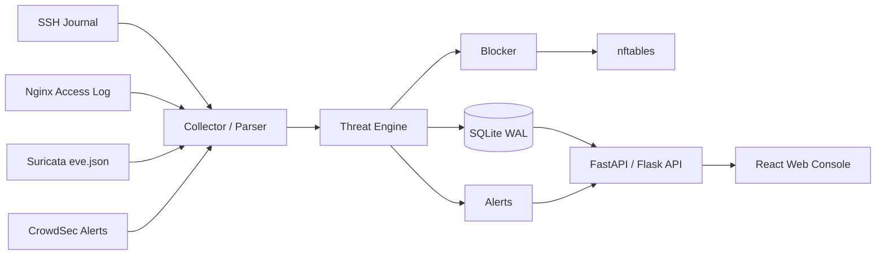

# SecMon Linux Security Monitor

SecMon 是一套以 Linux 為部署環境的輕量級資安偵測與攻擊 IP 管理平台。第一階段採用 SQLite，整合 SSH Journal、Nginx Access Log、Suricata IDS、CrowdSec 與 nftables，提供事件蒐集、威脅評分、即時告警、攻擊 IP 排名、白名單及封鎖管理。

> 目前狀態：系統設計與 MVP 規格階段，尚未提供正式環境可直接部署的完整程式碼。

## 核心目標

- 找出 SSH 暴力破解、Web 掃描、Port Scan、SQL Injection 等攻擊來源 IP。
- 將不同日誌來源轉換成統一安全事件格式。
- 保存事件、攻擊者彙總、告警、封鎖及稽核紀錄。
- 依時間窗口、事件次數、嚴重度與威脅分數判斷風險。
- 支援人工封鎖；規則驗證穩定後再啟用自動封鎖。
- 提供公司內部可操作的 Web 儀表板與報表。

## MVP 架構



## 前台功能

- 總覽儀表板：總事件數、攻擊 IP、高風險事件、目前封鎖 IP、日誌來源狀態。
- 事件趨勢：依小時或日期顯示 SSH、Web、IDS 等事件變化。
- 攻擊者 Top 10：依威脅分數、事件數及最後攻擊時間排序。
- 攻擊者詳細頁：顯示事件時間軸、攻擊類型、分數及封鎖紀錄。
- 事件查詢：依時間、IP、類型、嚴重度、Port、Username、URL 篩選。
- 即時告警：追蹤新告警、已確認、調查中、已處理及誤報。
- 封鎖與白名單：人工封鎖、解除、延長期限、CIDR 白名單管理。
- 報表中心：攻擊摘要、Top IP、封鎖紀錄與 CSV／JSON 匯出。

## 後端元件

| 元件 | 職責 |
|---|---|
| Collector | 讀取 journalctl、Nginx、Suricata 與 CrowdSec 資料 |
| Parser | 正規化來源 IP、時間、Port、攻擊類型、嚴重度與原始日誌 |
| Threat Engine | 去重、事件聚合、威脅評分、規則判定、建立告警 |
| Blocker | 檢查白名單並操作 nftables，管理封鎖到期與解除 |
| Web API | 提供 Dashboard、事件、攻擊者、告警及管理 API |
| Web Console | 提供管理者與分析人員操作介面 |

## 建議技術棧

- 前端：React、Vite、TypeScript、Tailwind CSS、ECharts 或 Recharts
- 後端：Python 3.11+、FastAPI 或 Flask
- 資料庫：SQLite 3，啟用 WAL、foreign_keys、busy_timeout
- 偵測：Suricata、CrowdSec、systemd journal、Nginx logs
- 封鎖：nftables
- 執行管理：systemd

## 文件目錄

- [系統架構與前後台功能設計](docs/ARCHITECTURE_AND_UI.md)
- [SQLite 資料庫設計](docs/DATABASE_DESIGN.md)
- [MVP 實作與部署計畫](docs/MVP_IMPLEMENTATION.md)

## 建議目錄結構

```text
secmon/
├── backend/
│   ├── api/
│   ├── collectors/
│   ├── parsers/
│   ├── services/
│   └── models/
├── frontend/
├── database/
│   ├── schema.sql
│   └── migrations/
├── config/
├── scripts/
├── systemd/
├── tests/
└── docs/
```

## 第一階段驗收條件

1. 能從 SSH Journal 正確取得失敗登入來源 IP。
2. 能將事件寫入 SQLite，且重複事件不會重複累計。
3. 能在攻擊者頁看到事件數、首次與最後發現時間及威脅分數。
4. 能依 IP、時間與攻擊類型查詢事件。
5. 能建立白名單並阻止白名單 IP 被封鎖。
6. 能以人工操作將 IP 加入 nftables set，並保存封鎖紀錄。
7. 所有封鎖、解除、白名單與設定修改皆留下 audit log。

## 安全原則

- MVP 初期先採偵測與人工封鎖，觀察誤判後再啟用自動封鎖。
- 公司 VPN、管理端、監控主機、反向代理及 Load Balancer 必須先加入白名單。
- 不可信任任意來源提供的 `X-Forwarded-For`；只信任已設定的代理網段。
- Web API 不直接以 root 執行；nftables 操作需透過最小權限 sudoers 或受控 helper。
- 密碼只保存 Argon2 或 bcrypt hash，不得保存明文密碼、API Key 或 Token。
- 原始日誌可能包含敏感資訊，須限制檔案權限並設定保存期限。

## 後續演進

SQLite 適合單機或少量感測來源的 MVP。當需求擴展到多台 Linux Agent、多人同時操作、高事件量或集中式管理時，建議演進為：

```text
Linux Agents → HTTPS Ingestion API / Queue → PostgreSQL → Central Web Console
```

## License

目前尚未指定授權條款。正式開源或公司內部發布前，需補上適用的 LICENSE 與第三方套件授權清單。
