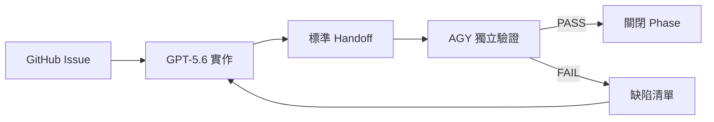

# GPT-5.6 與 AGY 交接及 Release Gate 規範

## 1. 目的

本文件規定 GPT-5.6 與 AGY 在 SecMon 專案中的交接方式，避免：

- 兩個 AI 同時修改相同檔案。
- 實作者自行宣告驗收通過。
- 只有摘要，沒有實際測試證據。
- 分支、服務、Port、資料庫或環境互相污染。
- 缺陷修復後沒有回歸測試。

## 2. 基本工作流



## 3. 單一 Writer 規則

同一時間，每個工作區只能有一個主要 Writer：

| 工作區 | 預設 Writer | Reviewer |
|---|---|---|
| Backend／Database／Collector／Blocker | GPT-5.6 | AGY |
| Frontend UI／Playwright／QA 文件 | AGY | GPT-5.6 |
| 核心架構文件 | GPT-5.6 | AGY |
| 驗收矩陣／Release Gate | AGY | GPT-5.6 提供證據 |

若需跨界修改，先在 Issue 留言：

```text
Cross-area write request
原因：
檔案：
預計變更：
避免衝突方式：
完成後驗證：
```

## 4. 分支建議

```text
main
├── feature/secmon-p0-foundation
├── feature/secmon-p1-ssh-sqlite
├── feature/secmon-p2-sources-api
├── feature/secmon-p3-web-console
├── feature/secmon-p4-blocking-rbac
└── feature/secmon-p5-release
```

每個 Phase 使用獨立分支；AGY 優先在同一 commit 上執行 verify-only，不直接把未授權修正混入 GPT-5.6 的實作 commit。

## 5. 環境宣告

每次交接都要列出：

```text
OS：
Repository：
Branch：
HEAD：
Python：
Node：
Database path：
API port：
Frontend port：
Suricata path：
Service names：
```

禁止使用模糊文字，例如「最新版」「目前環境」「預設 Port」。

## 6. GPT-5.6 → AGY Handoff

```markdown
# GPT-5.6 Handoff

## Identity
- Phase / Issue：
- Repository / branch / HEAD：
- Base commit：

## Scope
- 本次完成：
- 明確未完成：
- 未修改區域：

## Changes
- 修改檔案：
- Migration / schema：
- API contract：
- Config / systemd / firewall：

## Validation
| Command | Result | Evidence summary |
|---|---|---|

## Runtime
- Services：
- Ports：
- DB path：
- Test credentials：只可引用本機測試帳號，不可貼正式秘密

## Risk
- Security impact：
- Data migration risk：
- Known limitations：
- Rollback：

## AGY Checklist
- 必驗項目：
- 建議 fixture：
- 禁止操作：
```

Handoff 缺少 HEAD、修改檔案、驗證結果或已知限制時，AGY 可直接判定「handoff incomplete」，不開始 Gate。

## 7. AGY → GPT-5.6 驗證回報

```markdown
# AGY Validation Report

## Identity
- Phase / Issue：
- Tested HEAD：
- Environment：

## Gate Matrix
| Requirement | PASS/FAIL | Evidence | Notes |
|---|---|---|---|

## Defects
| Severity | Summary | Reproduction | Owner |
|---|---|---|---|

## Data Reconciliation
- API vs SQLite：
- UI vs API：
- SQLite vs nftables：

## Decision
PASS / PASS WITH RISKS / FAIL

## Next Action
- GPT-5.6 修復：
- AGY 回歸驗證：
- 是否允許進入下一 Phase：
```

## 8. Gate 等級

### Gate A：Static Gate

- lint
- formatting
- type check
- secret scan
- dependency lock consistency
- `git diff --check`

### Gate B：Unit Gate

- Parser
- validation
- event key
- threat score
- allowlist
- RBAC

### Gate C：Integration Gate

- Collector → SQLite
- API → SQLite
- Blocker → nftables → SQLite
- timer expiry
- backup / restore

### Gate D：UI Gate

- Desktop
- Mobile
- Loading / empty / error / permission
- browser console
- network failures
- accessibility basics

### Gate E：Security Gate

- shell injection
- SQL injection
- XSS
- CSV formula injection
- CSRF/session
- privilege escalation
- forged proxy headers

### Gate F：Release Gate

- installation reproducibility
- system restart
- rollback
- documentation accuracy
- known limitations
- no unresolved blocker

## 9. 證據標準

可接受證據：

- 實際命令與 exit code。
- 測試摘要及失敗名稱。
- SQL 查詢與結果。
- API request/response 摘要。
- Playwright assertion 結果。
- 截圖與對應測試步驟。
- Git commit、diff 與檔案清單。

不可接受：

- 「程式看起來正確」。
- 「應該已修好」。
- 只有截圖，沒有 assertion。
- 只有 AI 自評分數。
- 沒有標示 tested HEAD 的結果。

## 10. 缺陷修復循環

```text
AGY FAIL
  ↓
建立缺陷：最小重現、證據、嚴重度
  ↓
GPT-5.6 重現
  ↓
新增回歸測試
  ↓
最小修復與 commit
  ↓
GPT-5.6 Handoff
  ↓
AGY 針對原缺陷與基本測試回歸
```

修復 commit 不得順便加入無關重構，避免 Gate 範圍失控。

## 11. 停止條件

發生以下任一情況，立即停止自動化修改或封鎖測試：

- 工作目錄或 repository 與 Issue 不符。
- 發現 `.env`、私鑰或正式秘密可能被 staged。
- nftables 測試可能中斷目前 SSH 管理連線。
- 資料庫 migration 沒有備份或 rollback。
- Port 已被不明服務占用。
- 工作樹存在無法辨識的其他人修改。
- 測試目標是正式環境但沒有明確授權。

停止後要回報現況與安全處置，不可自行清除未知修改或 kill 不明程序。

## 12. Issue 狀態慣例

以 Issue checklist 表達狀態：

```text
[ ] Ready
[ ] GPT-5.6 implementation
[ ] GPT-5.6 self-validation
[ ] Handoff complete
[ ] AGY independent verification
[ ] Defects resolved
[ ] Release Gate passed
[ ] Documentation updated
```

若 GitHub 沒有對應 AI 帳號，Issue title 使用：

```text
[GPT-5.6][P1] SQLite 與 SSH 垂直切片
[AGY][P1] 獨立驗證 SQLite 與 SSH
```

## 13. Release 決策權

- GPT-5.6 可宣告「實作與自測完成」。
- AGY 可提出 Release Gate 判定。
- 正式啟用自動封鎖、正式部署或接受重大剩餘風險，仍由人類專案負責人決定。
