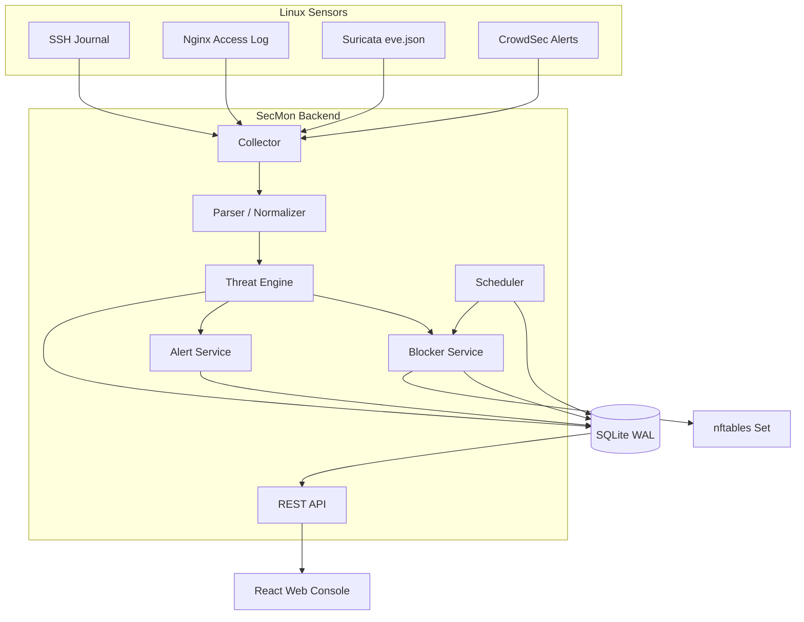

# SecMon 系統架構與前後台功能設計

## 1. 文件目的

本文件定義 SecMon Linux 資安監控系統的整體架構、前台資訊呈現、後台管理功能、資料流及 API 邊界，作為 UI/UX、前端、後端與測試人員的共同規格。

## 2. 系統角色

| 角色 | 主要權限 |
|---|---|
| Admin | 系統設定、規則管理、使用者管理、封鎖、解除及白名單 |
| Analyst | 查詢事件、處理告警、人工封鎖、填寫調查結果 |
| Viewer | 查看儀表板、事件、攻擊者與報表，不可執行變更 |

所有具有狀態變更的操作都必須記錄到 `audit_logs`。

## 3. 邏輯架構



## 4. 前台整體配置

建議使用深色管理介面，左側固定導覽列、上方工具列與主內容區。

```text
┌──────────────────────────────────────────────────────────────────┐
│ SecMon             時間範圍：最近 24 小時    更新    admin       │
├──────────────┬───────────────────────────────────────────────────┤
│ 總覽儀表板   │ KPI：事件｜攻擊 IP｜高風險｜封鎖｜來源            │
│ 攻擊者總覽   ├───────────────────────┬───────────────────────────┤
│ 事件查詢     │ 事件趨勢圖            │ 攻擊類型／風險分布        │
│ 即時告警     ├───────────────────────┴───────────────────────────┤
│ 封鎖管理     │ 高風險攻擊者 Top 10   │ 即時告警                  │
│ 白名單管理   ├───────────────────────┬───────────────────────────┤
│ 日誌來源     │ 封鎖狀態／來源狀態    │ CPU／RAM／Disk／DB         │
│ 報表中心     │                       │                           │
│ 系統設定     │                       │                           │
└──────────────┴───────────────────────┴───────────────────────────┘
```

## 5. 總覽儀表板

路徑：`/dashboard`

### 5.1 KPI 卡片

| 指標 | 計算方式 | 點擊行為 |
|---|---|---|
| 總事件數 | 所選時間內 `attack_events` 筆數 | 開啟事件查詢並套用時間條件 |
| 攻擊者 IP 數 | 所選時間內不同 `src_ip` 數 | 開啟攻擊者列表 |
| 高風險事件 | severity 1、2 或符合高風險門檻 | 開啟高風險事件列表 |
| 目前封鎖 IP | `blocked_ips.active = 1` | 開啟封鎖管理 |
| 日誌來源 | 正常、警告及異常來源統計 | 開啟日誌來源頁 |

卡片需顯示目前數值、與前一相同時間區間比較的變動百分比，以及資料最後更新時間。

### 5.2 事件趨勢

支援時間範圍：

- 最近 1 小時
- 最近 24 小時
- 最近 7 天
- 最近 30 天
- 自訂範圍

折線系列：總事件、SSH、Web、IDS。使用者可點選圖例隱藏系列；點擊資料點後進入事件頁並套用時間及類型條件。

### 5.3 攻擊類型分布

建議分類：

- `ssh_bruteforce`
- `invalid_user`
- `web_scan`
- `sensitive_file_scan`
- `sql_injection`
- `path_traversal`
- `port_scan`
- `suricata_alert`
- `malware`
- `exploit_attempt`
- `other`

### 5.4 風險等級分布

| severity | 顯示名稱 | 建議色彩語意 |
|---:|---|---|
| 1 | 嚴重 | 紅色 |
| 2 | 高 | 橘色 |
| 3 | 中 | 黃色 |
| 4 | 低 | 綠色 |
| 5 | 資訊 | 灰色 |

色彩不得作為唯一辨識方法，畫面仍需顯示文字與圖示。

### 5.5 高風險攻擊者 Top 10

欄位：

- 排名
- IP 位址
- 威脅分數
- 事件數
- 主要或最近攻擊類型
- 最後攻擊時間
- 狀態
- 查看詳情

狀態值：`observed`、`high_risk`、`blocked`、`allowlisted`。

### 5.6 即時告警

顯示最近高風險告警，每筆包含：

- 嚴重度
- 告警標題
- 來源 IP
- 說明
- 發生時間
- 處理狀態

MVP 使用 15～30 秒輪詢。第二階段可改成 WebSocket 或 Server-Sent Events。

### 5.7 系統健康狀態

顯示：

- SSH、Nginx、Suricata、CrowdSec 最後接收時間
- Collector 與 API systemd 狀態
- CPU、記憶體、磁碟使用率
- SQLite 主檔與 WAL 檔案大小
- 上次備份時間
- 資料庫 integrity check 結果

## 6. 攻擊者總覽

路徑：`/attackers`

### 篩選

- IP 關鍵字
- 最低威脅分數
- 攻擊類型
- 首次或最後出現時間
- 狀態
- 是否封鎖
- 是否白名單

### 表格欄位

- IP
- 首次發現
- 最後發現
- 總事件數
- SSH 次數
- Web 次數
- IDS 次數
- 威脅分數
- 最高嚴重度
- 狀態

MVP 不將 GeoIP 視為必要功能。加入 GeoIP 時，資料僅供輔助判斷，不得單獨作為封鎖依據。

## 7. 攻擊者詳細頁

路徑：`/attackers/:ip`

### 區塊

1. 基本資訊：IP、狀態、威脅分數、首次與最後發現時間。
2. 攻擊統計：SSH、Web、IDS、各攻擊類型次數。
3. 攻擊時間軸：依時間列出標準化事件與原始日誌。
4. 告警紀錄：相關告警的處理狀態與調查說明。
5. 封鎖歷史：封鎖時間、到期、解除、來源及原因。
6. 操作區：立即封鎖、封鎖指定期限、解除、白名單、觀察。

每個狀態變更操作均需二次確認，並要求輸入原因。

## 8. 事件查詢

路徑：`/events`

### 篩選條件

- 起迄時間
- 來源 IP／目的 IP
- 來源／目的 Port
- 攻擊類型
- 嚴重度
- 日誌來源
- Username
- HTTP Method
- Request Path
- 是否觸發封鎖

### 表格欄位

- 偵測時間
- 感測主機
- 來源
- 來源 IP 與 Port
- 目的 IP 與 Port
- 攻擊類型
- 嚴重度
- Signature
- 封鎖狀態

原始日誌預設收合，展開後應使用等寬字體並進行 HTML escaping，避免日誌內容造成 XSS。

## 9. 即時告警管理

路徑：`/alerts`

告警狀態：

```text
new → acknowledged → investigating → resolved
                            └──────→ ignored
```

欄位：

- 告警 ID
- 建立時間
- 嚴重度
- 攻擊者 IP
- 標題與說明
- 指派人員
- 狀態
- 解決時間
- 解決說明

所有狀態變更均寫入稽核紀錄。

## 10. 封鎖管理

路徑：`/blocks`

顯示：

- IP
- 原因
- 威脅分數
- 封鎖來源：`manual`、`auto`、`crowdsec`、`suricata`
- 封鎖時間
- 到期時間
- 剩餘時間
- nftables 同步狀態
- 操作人員

操作：解除、延長、改為無到期、查看相關事件、加入白名單。

### 安全要求

- Web API 不得直接拼接 shell 指令。
- IP 必須先以 Python `ipaddress` 驗證。
- nftables 操作只能透過固定參數的 helper 或 netlink library。
- 任何封鎖前都要執行白名單檢查。
- 防止封鎖本機、預設閘道、管理來源與代理伺服器。

## 11. 白名單管理

路徑：`/allowlist`

欄位：IP/CIDR、說明、啟用狀態、建立人、建立時間。

白名單事件仍需保存，但不得自動封鎖。新增白名單時需檢查是否有作用中的封鎖，並提示管理者是否同步解除。

## 12. 日誌來源管理

路徑：`/sources`

顯示：

- 名稱
- 類型
- 檔案路徑或 journal filter
- 啟用狀態
- 健康狀態
- 最後事件時間
- 今日接收數
- 今日解析錯誤數
- 最後錯誤訊息

健康狀態建議：

- `healthy`：在預期時間內持續接收
- `warning`：短時間無資料或解析錯誤率升高
- `error`：來源不可讀、程序停止或長時間無資料
- `disabled`：人工停用

「無事件」不一定代表異常；需依不同來源設定預期心跳與檔案更新策略。

## 13. 規則與系統設定

路徑：

- `/admin/rules`
- `/admin/settings`
- `/admin/users`
- `/admin/audit`

規則欄位：來源、攻擊類型、時間窗口、觸發次數、分數、嚴重度、自動封鎖、封鎖期間、啟用狀態。

系統設定：事件保留天數、刷新頻率、告警門檻、備份路徑、自動封鎖總開關、預設封鎖期間。

重要設定修改需記錄舊值與新值；密碼、Token 等秘密資料不得寫入 audit log。

## 14. REST API 草案

### Dashboard

```http
GET /api/dashboard/summary?range=24h
GET /api/dashboard/trend?range=24h&interval=1h
GET /api/dashboard/distribution?range=24h
GET /api/dashboard/top-attackers?range=24h&limit=10
GET /api/dashboard/health
```

### Attackers

```http
GET  /api/attackers
GET  /api/attackers/{ip}
GET  /api/attackers/{ip}/events
POST /api/attackers/{ip}/block
POST /api/attackers/{ip}/allowlist
```

### Events and Alerts

```http
GET   /api/events
GET   /api/events/{id}
GET   /api/alerts
PATCH /api/alerts/{id}
```

### Blocks and Allowlist

```http
GET    /api/blocks
POST   /api/blocks
PATCH  /api/blocks/{id}
DELETE /api/blocks/{id}
GET    /api/allowlist
POST   /api/allowlist
PATCH  /api/allowlist/{id}
DELETE /api/allowlist/{id}
```

### Administration

```http
GET /api/rules
POST /api/rules
PUT /api/rules/{id}
GET /api/settings
PUT /api/settings
GET /api/audit-logs
```

## 15. 前端狀態與錯誤呈現

每個資料區塊必須具備：

- Loading skeleton
- Empty state
- API error state
- Permission denied state
- 資料最後更新時間

禁止將 API 原始錯誤堆疊直接顯示給一般使用者。詳細錯誤應寫入伺服器日誌並回傳追蹤 ID。

## 16. 非功能性要求

- 預設使用 Asia/Taipei 顯示時間，資料庫統一保存 UTC ISO 8601。
- 所有列表使用伺服器端分頁與排序。
- API 對查詢參數設定最大時間範圍與最大回傳筆數。
- 重要變更 API 必須有 CSRF 防護或使用安全的 Bearer Token 架構。
- Session Cookie 必須設定 `HttpOnly`、`Secure`、`SameSite`。
- 登入與管理 API 必須限制速率。
- 原始日誌顯示與 CSV 匯出均需防止公式注入及 XSS。
