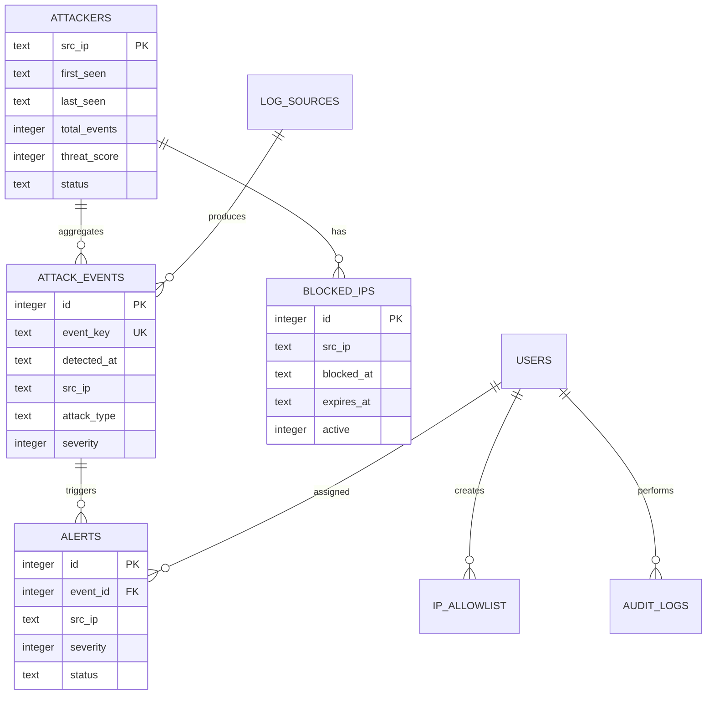

# SecMon SQLite 資料庫設計

## 1. 設計原則

SecMon MVP 採用 SQLite，適用於單機或少量 Linux 感測來源。設計重點如下：

- 事件明細與攻擊者彙總分離，避免 Dashboard 每次掃描全部事件。
- 使用 `event_key` 去除 Collector 重啟或重讀造成的重複事件。
- 所有時間以 UTC ISO 8601 字串保存，前端再轉換為使用者時區。
- 使用 WAL 模式支援 Collector 寫入與 Web API 同時讀取。
- 封鎖紀錄保留歷史，不覆寫舊紀錄。
- 白名單 CIDR 比對交由 Python `ipaddress` 處理。
- 管理操作完整保存稽核紀錄。

## 2. 資料表關聯



`attack_events.src_ip` 與 `attackers.src_ip` 採邏輯關聯，不強制建立 Foreign Key，以降低高頻事件寫入的耦合。更新彙總需在同一 transaction 中完成。

## 3. 初始化 PRAGMA

每個資料庫連線建立後執行：

```sql
PRAGMA journal_mode = WAL;
PRAGMA synchronous = NORMAL;
PRAGMA foreign_keys = ON;
PRAGMA busy_timeout = 5000;
```

正式環境不得透過多個程序各自執行長交易。Collector 應採小批次 transaction，Web API 查詢需限制時間範圍及回傳筆數。

## 4. 完整 schema

```sql
PRAGMA journal_mode = WAL;
PRAGMA synchronous = NORMAL;
PRAGMA foreign_keys = ON;
PRAGMA busy_timeout = 5000;

CREATE TABLE IF NOT EXISTS log_sources (
    id INTEGER PRIMARY KEY AUTOINCREMENT,
    name TEXT NOT NULL UNIQUE,
    source_type TEXT NOT NULL,
    source_path TEXT,
    config_json TEXT,
    enabled INTEGER NOT NULL DEFAULT 1 CHECK (enabled IN (0, 1)),
    status TEXT NOT NULL DEFAULT 'unknown'
        CHECK (status IN ('unknown', 'healthy', 'warning', 'error', 'disabled')),
    last_event_at TEXT,
    last_error TEXT,
    events_today INTEGER NOT NULL DEFAULT 0,
    parse_errors_today INTEGER NOT NULL DEFAULT 0,
    created_at TEXT NOT NULL DEFAULT CURRENT_TIMESTAMP,
    updated_at TEXT NOT NULL DEFAULT CURRENT_TIMESTAMP
);

CREATE TABLE IF NOT EXISTS attack_events (
    id INTEGER PRIMARY KEY AUTOINCREMENT,
    event_key TEXT NOT NULL UNIQUE,
    detected_at TEXT NOT NULL,
    sensor_host TEXT NOT NULL,
    source_id INTEGER,
    source_type TEXT NOT NULL,
    src_ip TEXT NOT NULL,
    src_port INTEGER CHECK (src_port IS NULL OR src_port BETWEEN 0 AND 65535),
    dst_ip TEXT,
    dst_port INTEGER CHECK (dst_port IS NULL OR dst_port BETWEEN 0 AND 65535),
    protocol TEXT,
    attack_type TEXT NOT NULL,
    severity INTEGER NOT NULL DEFAULT 3 CHECK (severity BETWEEN 1 AND 5),
    signature TEXT,
    http_method TEXT,
    request_path TEXT,
    username TEXT,
    blocked INTEGER NOT NULL DEFAULT 0 CHECK (blocked IN (0, 1)),
    raw_log TEXT,
    metadata_json TEXT,
    created_at TEXT NOT NULL DEFAULT CURRENT_TIMESTAMP,
    FOREIGN KEY (source_id) REFERENCES log_sources(id) ON DELETE SET NULL
);

CREATE TABLE IF NOT EXISTS attackers (
    src_ip TEXT PRIMARY KEY,
    first_seen TEXT NOT NULL,
    last_seen TEXT NOT NULL,
    total_events INTEGER NOT NULL DEFAULT 0,
    ssh_failures INTEGER NOT NULL DEFAULT 0,
    web_scans INTEGER NOT NULL DEFAULT 0,
    ids_alerts INTEGER NOT NULL DEFAULT 0,
    threat_score INTEGER NOT NULL DEFAULT 0,
    highest_severity INTEGER NOT NULL DEFAULT 5 CHECK (highest_severity BETWEEN 1 AND 5),
    last_attack_type TEXT,
    status TEXT NOT NULL DEFAULT 'observed'
        CHECK (status IN ('observed', 'high_risk', 'blocked', 'allowlisted')),
    updated_at TEXT NOT NULL DEFAULT CURRENT_TIMESTAMP
);

CREATE TABLE IF NOT EXISTS users (
    id INTEGER PRIMARY KEY AUTOINCREMENT,
    username TEXT NOT NULL UNIQUE,
    password_hash TEXT NOT NULL,
    display_name TEXT,
    role TEXT NOT NULL DEFAULT 'viewer'
        CHECK (role IN ('admin', 'analyst', 'viewer')),
    enabled INTEGER NOT NULL DEFAULT 1 CHECK (enabled IN (0, 1)),
    failed_login_count INTEGER NOT NULL DEFAULT 0,
    locked_until TEXT,
    last_login_at TEXT,
    created_at TEXT NOT NULL DEFAULT CURRENT_TIMESTAMP,
    updated_at TEXT NOT NULL DEFAULT CURRENT_TIMESTAMP
);

CREATE TABLE IF NOT EXISTS alerts (
    id INTEGER PRIMARY KEY AUTOINCREMENT,
    event_id INTEGER,
    src_ip TEXT NOT NULL,
    title TEXT NOT NULL,
    description TEXT,
    severity INTEGER NOT NULL CHECK (severity BETWEEN 1 AND 5),
    status TEXT NOT NULL DEFAULT 'new'
        CHECK (status IN ('new', 'acknowledged', 'investigating', 'resolved', 'ignored')),
    assigned_to INTEGER,
    acknowledged_at TEXT,
    resolved_at TEXT,
    resolution_note TEXT,
    created_at TEXT NOT NULL DEFAULT CURRENT_TIMESTAMP,
    updated_at TEXT NOT NULL DEFAULT CURRENT_TIMESTAMP,
    FOREIGN KEY (event_id) REFERENCES attack_events(id) ON DELETE SET NULL,
    FOREIGN KEY (assigned_to) REFERENCES users(id) ON DELETE SET NULL
);

CREATE TABLE IF NOT EXISTS blocked_ips (
    id INTEGER PRIMARY KEY AUTOINCREMENT,
    src_ip TEXT NOT NULL,
    reason TEXT NOT NULL,
    threat_score INTEGER NOT NULL DEFAULT 0,
    block_source TEXT NOT NULL DEFAULT 'manual'
        CHECK (block_source IN ('manual', 'auto', 'crowdsec', 'suricata')),
    firewall_type TEXT NOT NULL DEFAULT 'nftables',
    blocked_by INTEGER,
    blocked_at TEXT NOT NULL,
    expires_at TEXT,
    released_at TEXT,
    released_by INTEGER,
    release_reason TEXT,
    active INTEGER NOT NULL DEFAULT 1 CHECK (active IN (0, 1)),
    firewall_synced INTEGER NOT NULL DEFAULT 0 CHECK (firewall_synced IN (0, 1)),
    created_at TEXT NOT NULL DEFAULT CURRENT_TIMESTAMP,
    FOREIGN KEY (blocked_by) REFERENCES users(id) ON DELETE SET NULL,
    FOREIGN KEY (released_by) REFERENCES users(id) ON DELETE SET NULL
);

CREATE UNIQUE INDEX IF NOT EXISTS idx_unique_active_block
ON blocked_ips(src_ip)
WHERE active = 1;

CREATE TABLE IF NOT EXISTS ip_allowlist (
    id INTEGER PRIMARY KEY AUTOINCREMENT,
    ip_or_cidr TEXT NOT NULL UNIQUE,
    description TEXT,
    enabled INTEGER NOT NULL DEFAULT 1 CHECK (enabled IN (0, 1)),
    created_by INTEGER,
    created_at TEXT NOT NULL DEFAULT CURRENT_TIMESTAMP,
    updated_at TEXT NOT NULL DEFAULT CURRENT_TIMESTAMP,
    FOREIGN KEY (created_by) REFERENCES users(id) ON DELETE SET NULL
);

CREATE TABLE IF NOT EXISTS threat_rules (
    id INTEGER PRIMARY KEY AUTOINCREMENT,
    name TEXT NOT NULL UNIQUE,
    attack_type TEXT NOT NULL,
    source_type TEXT,
    time_window_seconds INTEGER NOT NULL CHECK (time_window_seconds > 0),
    threshold_count INTEGER NOT NULL CHECK (threshold_count > 0),
    score INTEGER NOT NULL DEFAULT 0 CHECK (score >= 0),
    severity INTEGER NOT NULL CHECK (severity BETWEEN 1 AND 5),
    auto_block INTEGER NOT NULL DEFAULT 0 CHECK (auto_block IN (0, 1)),
    block_duration_seconds INTEGER CHECK (block_duration_seconds IS NULL OR block_duration_seconds > 0),
    enabled INTEGER NOT NULL DEFAULT 1 CHECK (enabled IN (0, 1)),
    created_at TEXT NOT NULL DEFAULT CURRENT_TIMESTAMP,
    updated_at TEXT NOT NULL DEFAULT CURRENT_TIMESTAMP
);

CREATE TABLE IF NOT EXISTS audit_logs (
    id INTEGER PRIMARY KEY AUTOINCREMENT,
    user_id INTEGER,
    action TEXT NOT NULL,
    target_type TEXT,
    target_value TEXT,
    old_value TEXT,
    new_value TEXT,
    client_ip TEXT,
    request_id TEXT,
    created_at TEXT NOT NULL DEFAULT CURRENT_TIMESTAMP,
    FOREIGN KEY (user_id) REFERENCES users(id) ON DELETE SET NULL
);

CREATE TABLE IF NOT EXISTS system_settings (
    setting_key TEXT PRIMARY KEY,
    setting_value TEXT,
    value_type TEXT NOT NULL DEFAULT 'string'
        CHECK (value_type IN ('string', 'integer', 'boolean', 'json')),
    description TEXT,
    updated_at TEXT NOT NULL DEFAULT CURRENT_TIMESTAMP
);

CREATE TABLE IF NOT EXISTS system_state (
    state_key TEXT PRIMARY KEY,
    state_value TEXT,
    updated_at TEXT NOT NULL DEFAULT CURRENT_TIMESTAMP
);

CREATE INDEX IF NOT EXISTS idx_events_detected_at
ON attack_events(detected_at);

CREATE INDEX IF NOT EXISTS idx_events_src_ip
ON attack_events(src_ip);

CREATE INDEX IF NOT EXISTS idx_events_attack_type
ON attack_events(attack_type);

CREATE INDEX IF NOT EXISTS idx_events_severity
ON attack_events(severity);

CREATE INDEX IF NOT EXISTS idx_events_source_time
ON attack_events(source_type, detected_at);

CREATE INDEX IF NOT EXISTS idx_events_src_time
ON attack_events(src_ip, detected_at DESC);

CREATE INDEX IF NOT EXISTS idx_attackers_score
ON attackers(threat_score DESC);

CREATE INDEX IF NOT EXISTS idx_attackers_last_seen
ON attackers(last_seen DESC);

CREATE INDEX IF NOT EXISTS idx_alerts_status_created
ON alerts(status, created_at DESC);

CREATE INDEX IF NOT EXISTS idx_alerts_src_ip
ON alerts(src_ip, created_at DESC);

CREATE INDEX IF NOT EXISTS idx_blocks_active_expiry
ON blocked_ips(active, expires_at);

CREATE INDEX IF NOT EXISTS idx_audit_created
ON audit_logs(created_at DESC);
```

## 5. 事件去重

`event_key` 建議使用 SHA-256，由以下標準化欄位組成：

```text
detected_at | sensor_host | source_type | src_ip | src_port |
dst_ip | dst_port | attack_type | signature | raw_log
```

注意事項：

- 先將時間格式與空值正規化。
- 原始 JSON 欄位需使用固定 key 排序。
- 不應只使用整行日誌；日誌工具可能在重啟後加入不同前綴。
- `INSERT OR IGNORE` 成功新增事件後，才更新 `attackers` 彙總。

## 6. 攻擊者彙總更新

建議在同一 transaction 內執行：

1. 新增 `attack_events`。
2. 確認新增成功而非重複。
3. 以 UPSERT 更新 `attackers`。
4. 執行規則判定。
5. 必要時建立 `alerts`。

範例：

```sql
INSERT INTO attackers (
    src_ip, first_seen, last_seen, total_events,
    ssh_failures, web_scans, ids_alerts,
    threat_score, highest_severity, last_attack_type
)
VALUES (?, ?, ?, 1, ?, ?, ?, ?, ?, ?)
ON CONFLICT(src_ip) DO UPDATE SET
    last_seen = excluded.last_seen,
    total_events = attackers.total_events + 1,
    ssh_failures = attackers.ssh_failures + excluded.ssh_failures,
    web_scans = attackers.web_scans + excluded.web_scans,
    ids_alerts = attackers.ids_alerts + excluded.ids_alerts,
    threat_score = MIN(1000, attackers.threat_score + excluded.threat_score),
    highest_severity = MIN(attackers.highest_severity, excluded.highest_severity),
    last_attack_type = excluded.last_attack_type,
    updated_at = CURRENT_TIMESTAMP;
```

## 7. 威脅評分建議

評分必須可由 `threat_rules` 與 `system_settings` 調整，不應完全寫死。

初始基準可採：

| 攻擊類型 | 基礎分數 |
|---|---:|
| invalid_user | 10 |
| ssh_bruteforce | 20 |
| web_scan | 15 |
| sensitive_file_scan | 25 |
| port_scan | 20 |
| sql_injection | 40 |
| path_traversal | 40 |
| exploit_attempt | 60 |
| malware | 70 |

嚴重度加分：severity 1 加 30、2 加 20、3 加 10、4 加 5、5 不加分。

累積分數僅供排序與規則判定，不代表攻擊已被確認。建議加入時間衰減或每日重算機制，避免多年以前的低風險事件永久累積成高風險。

## 8. Dashboard 查詢範例

### 最近 24 小時不同攻擊 IP

```sql
SELECT COUNT(DISTINCT src_ip)
FROM attack_events
WHERE detected_at >= ?;
```

### 攻擊類型分布

```sql
SELECT attack_type, COUNT(*) AS event_count
FROM attack_events
WHERE detected_at >= ? AND detected_at < ?
GROUP BY attack_type
ORDER BY event_count DESC;
```

### 高風險攻擊者

```sql
SELECT
    src_ip,
    total_events,
    threat_score,
    highest_severity,
    last_attack_type,
    last_seen,
    status
FROM attackers
WHERE last_seen >= ?
ORDER BY threat_score DESC, last_seen DESC
LIMIT ?;
```

### 目前作用中的封鎖

```sql
SELECT *
FROM blocked_ips
WHERE active = 1
ORDER BY blocked_at DESC;
```

## 9. 白名單判斷

SQLite 只保存文字格式 IP/CIDR，讀取後由應用程式判斷：

```python
from ipaddress import ip_address, ip_network


def is_allowlisted(src_ip: str, entries: list[str]) -> bool:
    address = ip_address(src_ip)
    return any(address in ip_network(item, strict=False) for item in entries)
```

資料寫入前要驗證 IP/CIDR 格式。禁止使用 SQL `LIKE` 或字串前綴判斷 CIDR。

## 10. 備份、清理與完整性

### 一致性備份

WAL 模式下應使用 SQLite backup API 或 `.backup`：

```bash
sqlite3 /var/lib/secmon/security.db \
  ".backup '/var/backups/secmon/security-$(date +%F-%H%M%S).db'"
```

### 完整性檢查

```bash
sqlite3 /var/lib/secmon/security.db "PRAGMA quick_check;"
```

### 保存政策

建議初始設定：

- `attack_events`：90 天
- `alerts`：365 天
- `blocked_ips`：365 天以上或依公司稽核要求
- `audit_logs`：至少 365 天
- 備份：每日一份，保留 30 天

清理大量事件時採分批刪除，避免長交易與 WAL 過度膨脹。

## 11. 權限與檔案位置

建議：

```text
/var/lib/secmon/security.db        root:secmon 0640
/var/lib/secmon/security.db-wal    root:secmon
/var/lib/secmon/security.db-shm    root:secmon
/var/backups/secmon/               root:secmon 0750
```

Web API 與 Collector 使用專用 `secmon` 帳號，不允許其他一般帳號直接讀取資料庫。備份檔案包含安全事件與可能的個人資料，也必須套用相同保護。

## 12. SQLite 升級條件

出現以下情況時，應評估遷移 PostgreSQL：

- 多台 Agent 需遠端集中寫入。
- 每秒大量事件且持續產生鎖競爭。
- 多位分析人員同時執行複雜查詢。
- 需要高可用、複寫、集中備份或更細緻資料權限。
- 事件量成長到單機清理與索引維護困難。

遷移時可保留相同核心實體：`attack_events`、`attackers`、`alerts`、`blocked_ips`、`ip_allowlist`、`audit_logs`。
