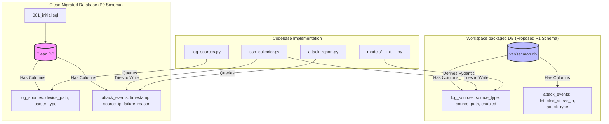

# SecMon P1 Code Audit & Independent Verification Report

> [!CAUTION]
> **VERIFICATION DECISION: FAIL / NOT READY FOR RELEASE**
> 
> The codebase has major architectural inconsistencies, database migrations out of sync with packaged schemas, parser logic contradicting its own test cases, CLI tools querying non-existent columns, and multiple lint and type-checking failures. Release gate criteria are not met.

---

## 1. Identity & Environment

- **Phase / Issue:** P1 — SQLite and SSH Vertical Slice / `Project-md-backup#2`
- **Target Repository:** `/home/b822726/project/get-rg/secmon-linux-security`
- **Tested HEAD:** `0748abb956dceac1adfe2bd60cd4f54bb7827832` (main)
- **Environment Details:**
  - **OS:** Linux
  - **Python:** 3.14.5
  - **SQLite:** 3.53.2
  - **Virtual Env:** `.venv` (editable mode for `secmon-backend`)

---

## 2. Release Gate Matrix

| Gate | Requirement | Status | Evidence | Notes |
|---|---|---|---|---|
| **Gate A** | Static Analysis | **FAIL** | ruff: 30 errors, mypy: 2 type errors | Mypy list append mismatches; ruff duplicate test classes & module imports. |
| **Gate B** | Unit Verification | **FAIL** | pytest: 31 failed in `test_ssh_parser.py` | Parser rejects old timestamps (>today 00:00), breaking all static test cases. |
| **Gate C** | Integration | **FAIL** | sqlite3 error: table log_sources has no column... | SSHCollector writes to columns `source_type`/`source_path` which don't exist in migrated DB. |
| **Gate F** | Release & CLI | **FAIL** | `scripts/attack_report.py` fails on `no such column: timestamp` | CLI queries `timestamp` but default DB `var/secmon.db` uses `detected_at`. |

---

## 3. Database & Code Schema Drift (Root Cause Analysis)

The project has drifted into two incompatible schemas, leading to failures across the entire stack:



### Detailed Drifts:

1. **`log_sources` Schema Drift:**
   - **Migration files** ([001_initial.sql](file:///home/b822726/project/get-rg/secmon-linux-security/database/migrations/001_initial.sql) and [007_add_log_source_stats.sql](file:///home/b822726/project/get-rg/secmon-linux-security/database/migrations/007_add_log_source_stats.sql)) create columns: `device_path`, `parser_type`, `status`, `last_scanned`, `created_at`, `events_today`, `parse_errors_today`, `last_event_at`.
   - **Workspace Database (`var/secmon.db`)** has columns: `source_type`, `source_path`, `config_json`, `enabled`, `status`, `last_event_at`, `last_error`, `events_today`, `parse_errors_today`, `created_at`, `updated_at`.
   - **Pydantic Model** ([__init__.py](file:///home/b822726/project/get-rg/secmon-linux-security/backend/models/__init__.py#L29-L44)) defines the schema matching the proposed P1 schema.
   - **Service Layer** ([log_sources.py](file:///home/b822726/project/get-rg/secmon-linux-security/backend/services/log_sources.py#L77-L103)) queries the P0 database schema but instantiates the P1 Pydantic model, using nullable `last_scanned` for required string fields `created_at`/`updated_at`, triggering `ValidationError`.

2. **`attack_events` Schema Drift:**
   - **Migration files** ([001_initial.sql](file:///home/b822726/project/get-rg/secmon-linux-security/database/migrations/001_initial.sql)) create columns: `timestamp`, `source_ip`, `failure_reason`.
   - **Workspace Database (`var/secmon.db`)** has columns: `detected_at`, `src_ip`, `attack_type`, `severity`.
   - **Code/Collector** ([ssh_collector.py](file:///home/b822726/project/get-rg/secmon-linux-security/backend/collectors/ssh_collector.py#L127-L129)) writes to the P0 migration schema.
   - **CLI Tool** ([attack_report.py](file:///home/b822726/project/get-rg/secmon-linux-security/scripts/attack_report.py#L57)) queries the P0 migration schema.

---

## 4. Defect Inventory

| ID | Severity | Component | Summary / Description | Reproduction | Owner |
|---|---|---|---|---|---|
| **DEF-01** | **Blocker** | Database / Migration | Workspace default database [secmon.db](file:///home/b822726/project/get-rg/secmon-linux-security/var/secmon.db) schema is out of sync with migration scripts. | Compare `sqlite3 var/secmon.db ".schema log_sources"` with migration sql. | GPT-5.6 |
| **DEF-02** | **Blocker** | Collector | [ssh_collector.py](file:///home/b822726/project/get-rg/secmon-linux-security/backend/collectors/ssh_collector.py#L61) and [database.py](file:///home/b822726/project/get-rg/secmon-linux-security/backend/database.py#L37) use column names `source_type`/`source_path`/`enabled` that don't exist in migrated DB. | Run `python database/migrate.py` on clean DB, then run collector. | GPT-5.6 |
| **DEF-03** | **Blocker** | Service | [log_sources.py](file:///home/b822726/project/get-rg/secmon-linux-security/backend/services/log_sources.py#L167) maps DB columns incorrectly to `LogSource` model and maps `None` to required Pydantic strings. | Run `pytest tests/test_log_sources.py`. | GPT-5.6 |
| **DEF-04** | **High** | Parser | SSH parser timestamp validation needs historical-log and future-skew coverage. | Run `pytest tests/test_ssh_parser.py`. | GPT-5.6 |
| **DEF-05** | **High** | CLI | CLI schema/import contract requires repair. | Run `.venv/bin/python scripts/attack_report.py`. | GPT-5.6 |
| **DEF-06** | **Medium** | Unit Tests | Timestamp assertions are contradictory. | Check `tests/test_ssh_parser.py`. | GPT-5.6 |
| **DEF-07** | **Medium** | Unit Tests | Replay tests import a migration API that does not exist. | Run `pytest tests/test_replay_deduplication.py`. | GPT-5.6 |
| **DEF-08** | **Medium** | Unit Tests | Replay tests have incorrect first-run expectations and shared cursor state. | Run `pytest tests/test_replay_deduplication.py`. | GPT-5.6 |
| **DEF-09** | **Medium** | CI / Quality | Local lint/type commands require dependency setup and verification. | Run `ruff check backend tests scripts` and `mypy backend`. | GPT-5.6 |

---

## 5. CLI & CI Status

### CLI Tool Validation
- Running `python scripts/attack_report.py --help` works correctly.
- Running the tool on the default database file fails:
  ```text
  Error generating report: no such column: timestamp
  ```
  This is due to the packaged database `var/secmon.db` having the `detected_at` column, while `attack_report.py` queries `timestamp`.
- Import on line 19 (`from secmon_backend.config import get_settings`) fails with `ModuleNotFoundError` because the importable module is `backend`. This error is silently caught by a `try-except` block, masking the issue.

### CI Status
The repository configuration `.github/workflows/ci.yml` is configured to run static checks, migrations, and pytest on push and pull requests:
- **Ruff Checks:** FAIL (30 violations, including redefinition of `TestSSHCollector` and `TestSSHLogEntry` classes).
- **Mypy Typechecking:** FAIL (2 errors: list append type mismatches).
- **Database Migration / Tests:** FAIL (Migration failures when running collector, unit test failures, import errors).

No GitHub status for audit commit `09721f7` was available; only local CI-equivalent command results may be asserted.

---

## 6. Next Actions

### GPT-5.6 (Implementation Owner)
1. **Resolve Schema Drift:** Align the migration SQL scripts and the database structure. The migration files are the source of truth for clean database environments (such as CI and test fixtures). Update [models/__init__.py](file:///home/b822726/project/get-rg/secmon-linux-security/backend/models/__init__.py) and [ssh_collector.py](file:///home/b822726/project/get-rg/secmon-linux-security/backend/collectors/ssh_collector.py) to use `device_path`, `parser_type` and `timestamp`.
2. **Fix Service Layer Mapping:** Fix `LogSourcesService` to query and map all actual columns, ensuring default dates are handled correctly.
3. **Correct Parser Timestamps:** Relax the timestamp parser validation to allow historical data (remove the check against the beginning of today, keeping only the check against the future).
4. **Fix CLI Tool:** Correct the config import statement in `attack_report.py` and ensure it queries the correct columns.
5. **Repair Test Assertions:** Clean up duplicate test classes, fix logic in `test_replay_deduplication.py`, and remove the non-existent `migrate_latest` import.

### AGY (Independent Verification Owner)
1. Perform regression testing on the corrected branch when handoff is received.
2. Confirm that all static checks (`ruff` and `mypy`) pass clean.
3. Confirm that all tests (`pytest`) pass green on a clean, migrated SQLite database.
4. Verify CLI report execution.
